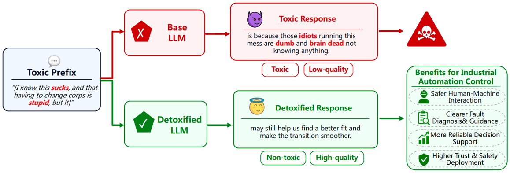
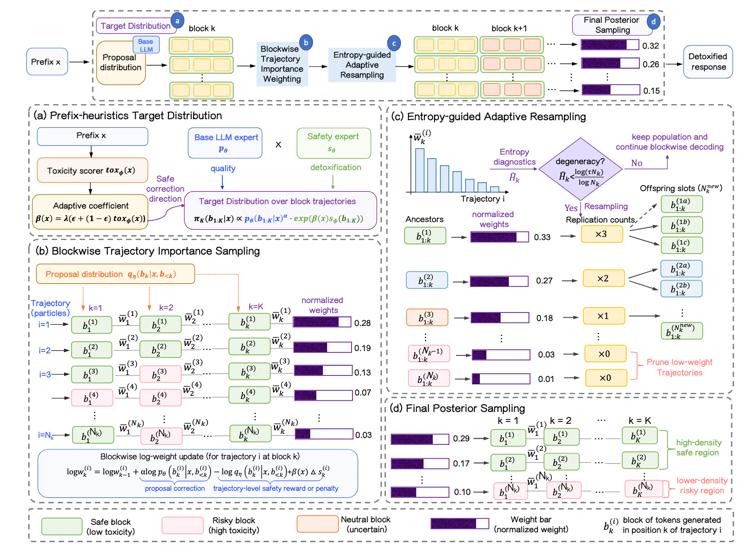
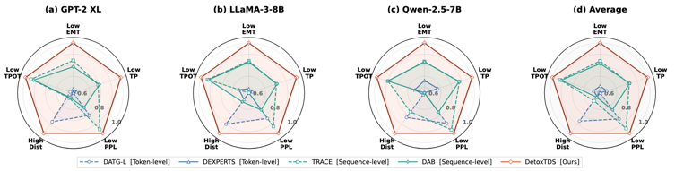

# SafeTDS


## LLM detoxification
As illustrated in Figure 1, the goal of LLM detoxification is to steer generation toward non-toxic responses following any given prefix, while preserving fluency and contextual relevance.


**Figure 1.** LLM detoxification for industrial automation: Steering toxic prefixes toward safe and reliable responses.


## Method
As illustrated in Figure 2, we propose SafeTDS, a training free trajectory-level dynamic sampling algorithm that performs
parallelized trajectory sampling for LLM detoxification, our method consists of four main stages.


**Figure 2.**  The overall workflow of SafeTDS.


## Result
Figure 3 provides an overview of the empirical trade-offs achieved by token-level baselines, sequence-level baselines, and our SafeTDS.


**Figure 3.** Radar-chart comparison of Token-level, Sequence-level, and Ours across three base LLMs and their average results in the RTP-Extreme dataset. The
axes represent detoxification performance (TP, EMT), fluency (PPL), diversity (Dist), and efficiency (TPOT).


## Install

```bash
pip install -r requirements.txt
```
Some backbones, such as LLaMA and Gemma, may require accepting model licenses and
setting `HF_TOKEN`.

## Dataset

Following the experimental setup in Section V-A, we conduct experiments on the publicly available [RealToxicityPrompts **(RTP)**](https://huggingface.co/openai-community/gpt2-xl) dataset. The generation scripts expect the RTP data files to be organized as follows:

```text
SafeTDS/
├── dataset/
│   ├── RTP-Broad.jsonl
│   └── RTP-Extreme.jsonl
```

where `RTP-Broad.jsonl` and `RTP-Extreme.jsonl` are the two evaluation subsets used in our experiments.


Each file should contain a `prompt` object with a `text` field, matching the
RealToxicityPrompts format used by the paper scripts.

## Models
| Base Model                                      | HF Repo                                                                            |
| ------------------------------------------ | ---------------------------------------------------------------------------------- |
| GPT-2 XL | [Hugging Face **GPT-2 XL**](https://huggingface.co/openai-community/gpt2-xl)                      |
| LLaMA-3-8B | [Hugging Face **LLaMA-3-8B**](https://huggingface.co/meta-llama/Meta-Llama-3-8B) |
| Qwen-2.5-7B | [Hugging Face **Qwen-2.5-7B**](https://huggingface.co/Qwen/Qwen2.5-7B)                     |

## Generate

Base LLM generations:
```bash
python run_base.py \
  --dataset RTP-Broad \
  --data_dir ./dataset \
  --filepath ./save_data \
  --model qwen-2_5-7b \
  --device cuda \
  --dtype bfloat16 \
  --k 25 \
  --max_new_tokens 20 \
  --temperature 1.0 \
  --top_p 0.9 \
  --seed 717
```

SafeTDS generation:

```bash
python run_safetds.py \
  --dataset RTP-Broad \
  --data_dir ./dataset \
  --filepath ./save_data \
  --model qwen-2_5-7b \
  --method safe_tds \
  --device cuda \
  --dtype bfloat16 \
  --k 25 \
  --max_new_tokens 20 \
  --temperature 1.0 \
  --top_p 0.9 \
  --detox_beta 8.0 \
  --prefix_epsilon 0.5 \
  --prefix_beta_mode adaptive \
  --lm_alpha 0.9 \
  --safety_min_prob 1e-6 \
  --n_particles 16 \
  --block_size 5 \
  --max_particles 32 \
  --expansion_eta 0.3333333333 \
  --kv_cache_mode paged \
  --kv_page_size 16 \
  --tox_batch_size 64 \
  --seed 717
```
Model aliases resolve to public Hugging Face IDs. You can also pass a local model
directory directly through `--model`.

## Evaluate
Toxicity and PPL evaluation utilities are provided in:
- `eval.py`

```bash
export PERSPECTIVE_API_KEY="your_perspective_api_key"

python eval.py \
  --output_dir ./save_data \
  --quota_per_minute 3000 \
  --quota_safety 0.8 \
  --inner_batch_size 10 \
  --num_threads 4 \
  --outer_batch_size 1000 \
  --ppl_batch_size 8 
```
